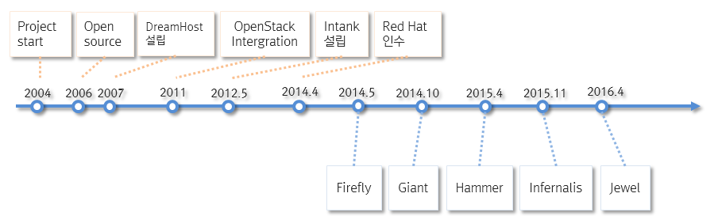

Intro to CEPH
=============

CEPH means?
-----------

CEPH란 무엇일까?

::

   a free-software storage platform, implements object storage on a single distributed compute cluster,
   and provides interfaces for object-, block- and file-level storage. (in Wikipedia)

한 줄 요약해서, Open soure software distributed object, block and file supported storage라고 할 수 있다.

History of CEPH
---------------

* 2004년 UCSC 대학의 Sage Weil의 프로젝트에서 시작
* 어원 : cephalopods(두족류)  여러 개의 촉수가 있는 형상이 분산 파일 시스템에 적합한 상징성
* 2006년 오픈소스화(LGPLv2)
* 2014년 Inktank사가 Red Hat에 인수

.. toctree::
   :glob:

   intro_to_ceph_*